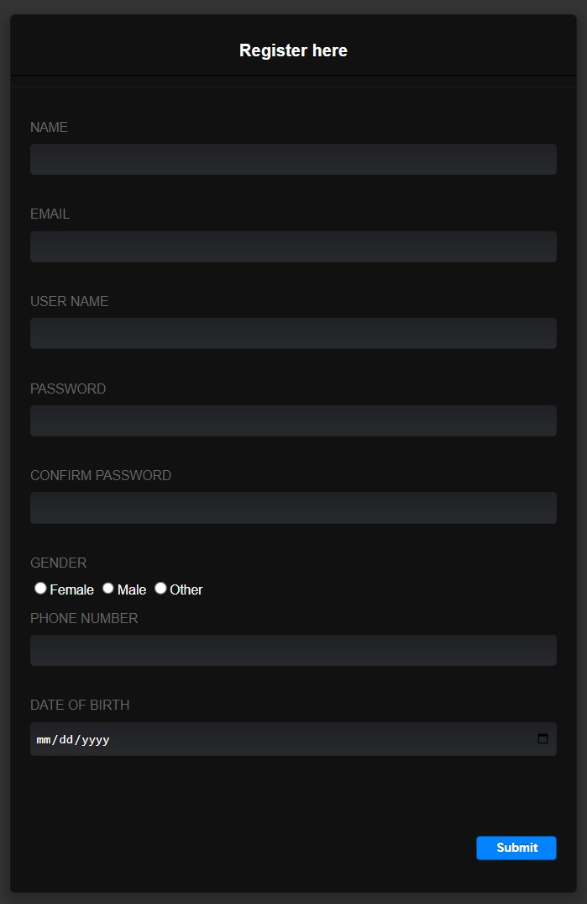
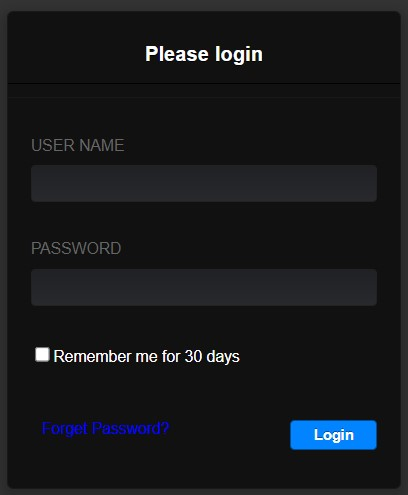
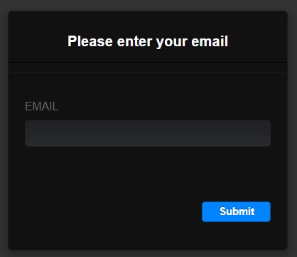
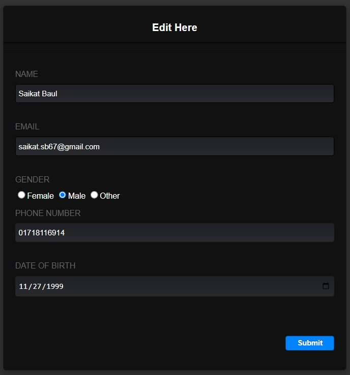
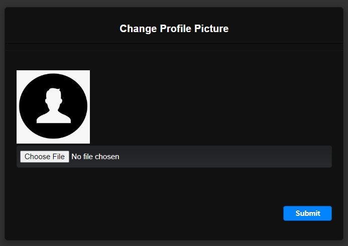
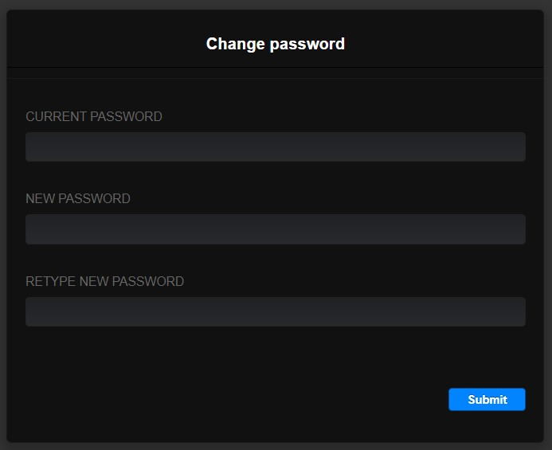
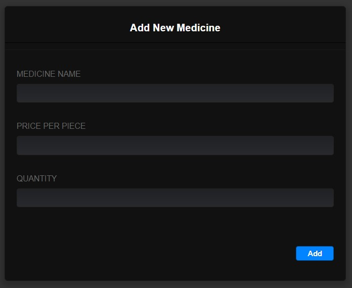

# Documentation For Pharmacy Management System

## Overview

The Pharmacy Management System is a system that aims to increase the efficiency of medical pharmacies by digitalizing their operations. It is a web-based Medicine business delivery system. This makes it easier for pharmacies to arrange, maintain and secure medication information. Its functions assist in the solution of manual pharmacy management problems. Customers can easily find their necessary medicines by using this system. Customers can easily order medicines from home. By using this system, pharmacy staff will take the orders. They will take the necessary steps to ensure that the buyer receives the product while sitting at home. A Pharmacy Management System is used to keep track of all medicine supplies. It controls and maintains the pharmacy team in order to create good working relationships and outputs. This can also greatly increase client satisfaction while also protecting medications from expiring. The pharmacy management system is developed to improve pharmacy quality, safety and performance. It is a computer-based system to store vital information and improves the efficiency of medical shops. The main objective of the Pharmacy Management System is to monitor the information for the Medicine supplies, Inventory, Sales. It records every aspect of this pharmacy. Billing, stock management, inventory records, customer administration are the key features of this program.

* Users
  * Store Officer
  * Staff
  * Delivery Man
  *	Customers
* Scopes
  * Profile Management Features:
    * Store officers and customers can create new profiles with valid information.
    * All users can login with a valid username and password.
    * After successful login all users can view their dashboard.
    * All users can view their own profile details.
    * All users can update their information with valid information.
    * All users can change their password.
    * All users can recover password after verification.

  * User Management Features:
    * Store officers can remove staff and delivery man.
    * Store officers can view customer list.

  * Medicine Management Features:
    * Store officers and staff can add new medicine to the inventory.
    * Store officers, staff and customers can perform search operations on medicines.
    * Store officers, staff and customers can view the full medicine list.
    * Store officers and staff can update medicine information.
    * Store officers can remove medicine from inventory.

  * Order Management Features:
    * Customers can add medicine to the cart.
    * Customers can place an order. Status: Pending Order
    * After successful payment the status changes automatically. Status: Paid Pending Order
    * Staff can view all paid pending orders.
    * Staff packs order and notify delivery man by clicking notify button. Status: Shipping Order
    * After delivery, delivery man changes order status to proceed order by clicking proceed button. Status: Proceed Order

  * Sales Management Features:
    * Store Officers can view all sales (monthly, yearly).
    * Store Officers can view net profit.
    * Staff and delivery man can view their individual sales. 

**This is the client side of the Pharmacy Management System site.**

## Registration Page

<p align="center"> 
    
</p>

```
Method: Post
```

| Parameter           | Input_Type  | Description  |
| ------------------- | ----------- | ------------ |
| Name                | text        | It is a mandatory field. Must be 2 words and only A-Z, a-z, Dash(-) and Period( ) are allowed. |
| Email               | text        | It is a mandatory field. Must be a valid email and user cannot use same email to open different account. |
| User_Name           | text        | It is a mandatory field. Only a-z, 0-9, Dash(-) and Period( ) are allowed and user cannot use same username to open different account. |
| Password            | password    | It is a mandatory field. Password  must contain atleast 8 charecters. |
| Confirm_Password    | password    | It is a mandatory field. Password and confirm passward need to be same.  |
| Gender              | radio       | It is a mandatory field. |
| Phone_Number        | text        | It is a mandatory field. Only 0-9 is allowed and length must be exact 11. |
| Date_of_Birth       | date        | It is a mandatory field. |

[View File](View/Registration.php) [Model File](Model/modelStoreOfficer.php) [Controller File](Controller/RegistrationValidation.php)

## Login Page

<p align="center">  
    
</p>

```
Method: Post
```

| Parameter           | Input_Type  | Description  |
| ------------------- | ----------- | ------------ |
| User_Name           | text        | It is a mandatory field. It needs to match with any user name in the database. |
| Password            | password    | It is a mandatory field. It needs to match with that user name's password in the database.|

[View File](View/Login.php) [Controller File](Controller/LoginValidation.php)

## Forget Password Page

<p align="center">
    
</p>

```
Method: Post
```

| Parameter           | Input_Type  | Description  |
| ------------------- | ----------- | ------------ |
| Email               | text        | It is a mandatory field. It need to match with any email in the database. |

## Edit Profile Page

<p align="center"> 
    
</p>

```
Method: Post
```

| Parameter           | Input_Type  | Description  |
| ------------------- | ----------- | ------------ |
| Name                | text        | It is a mandatory field. Must be 2 words and only A-Z, a-z, Dash(-) and Period( ) are allowed. |
| Email               | text        | It is a mandatory field. Must be a valid email and user cannot use same email to open different account. |
| Gender              | radio       | It is a mandatory field. |
| Phone_Number        | text        | It is a mandatory field. Only 0-9 is allowed and length must be exact 11. |
| Date_of_Birth       | date        | It is a mandatory field. |

## Change Profile Picture Page

<p align="center">
    
</p>

```
Method: Post
```

| Parameter           | Input_Type  | Description  |
| ------------------- | ----------- | ------------ |
| Profile_Picture     | file        | It is a mandatory field. Image size must be less than 4mb and only JPG, JPEG & PNG files are allowed. |

## Change Password Page

<p align="center">
    
</p>

```
Method: Post
```

| Parameter           | Input_Type  | Description  |
| ------------------- | ----------- | ------------ |
| Current_Password    | password    | It is a mandatory field. It needs to match with the password stored in database.|
| New_Password        | password    | It is a mandatory field. Password must contain atleast 8 charecters.|
| Retype_New_Password | password    | It is a mandatory field. New password and retype new passward need to be same |

## Add New Medicine Page

<p align="center"> 
    
</p>

```
Method: Post
```

| Parameter           | Input_Type  | Description  |
| ------------------- | ----------- | ------------ |
| Medicine_Name       | text        | It is a mandatory field. Only A-Z, a-z, 0-9, +, *, Dash(-) and Period( ) are allowed. |
| Price_Per_Piece     | text        | It is a mandatory field. Only 0-9 is allowed. |
| Quantity            | text        | It is a mandatory field. Only 0-9 is allowed. |

## Edit Medicine Page

<p align="center"> 
    
</p>

```
Method: Post
```

| Parameter           | Input_Type  | Description  |
| ------------------- | ----------- | ------------ |
| Medicine_Name       | text        | It is a mandatory field. Only A-Z, a-z, 0-9, +, *, Dash(-) and Period( ) are allowed. |
| Price_Per_Piece     | text        | It is a mandatory field. Only 0-9 is allowed. |
| Quantity            | text        | It is a mandatory field. Only 0-9 is allowed. |